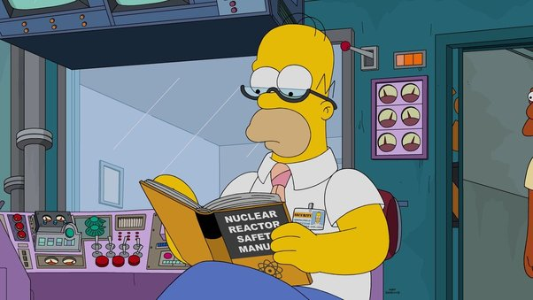

  

<h3 align="center">Sistema de control para reactores</h3>

---

 Irradia seguridad
      

## 📝 Lista de contenidos

- [Planteo del problema](#problem_statement)
- [Instalación](getting_started)
  - [Requisitos previos](prerequisites)
  - [Pasos](set_up)
- [Uso](#usage)
- [Cambios futuros](#future_scope)
- [Autores](#authors)

## 🧐 Planteo del problema 

La energía nuclear es una de las formas más limpias de generar energía. Sin embargo, requiere una serie de mecanismos que garanticen la seguridad durante su generación. Este sistema tiene como objectivo simplificar el trabajo de los operadores y agregar protecciones automáticas.
